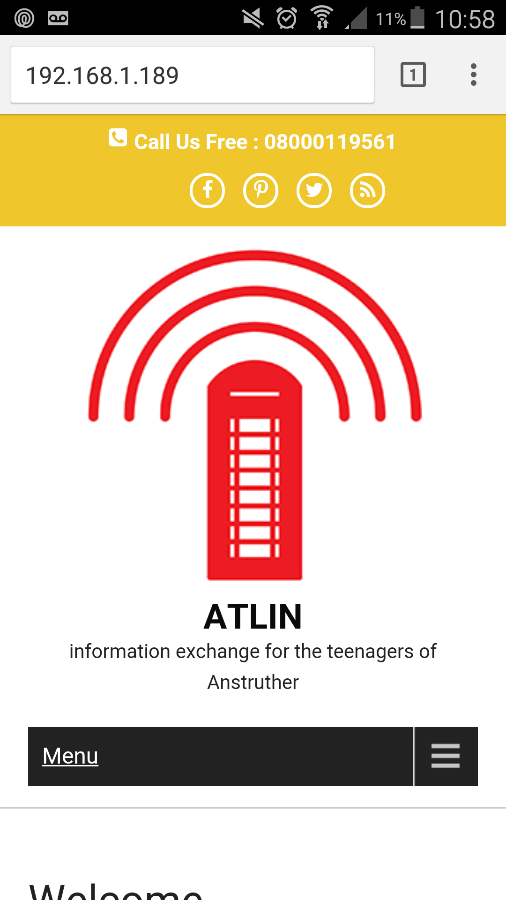

# ATLIN (Anstruther Teenager Local Information Network)

#### A space to share games, tutorials and secrets. We are using under-used spaces such as phone boxes to create safe, local networks for teenagers of this local area.

*By: Rachel Rayns, Jude Thomas, Otis, Lexie, Ewan at the Mozilla Open IoT Design Sprint in Anstruther, June 2016*

